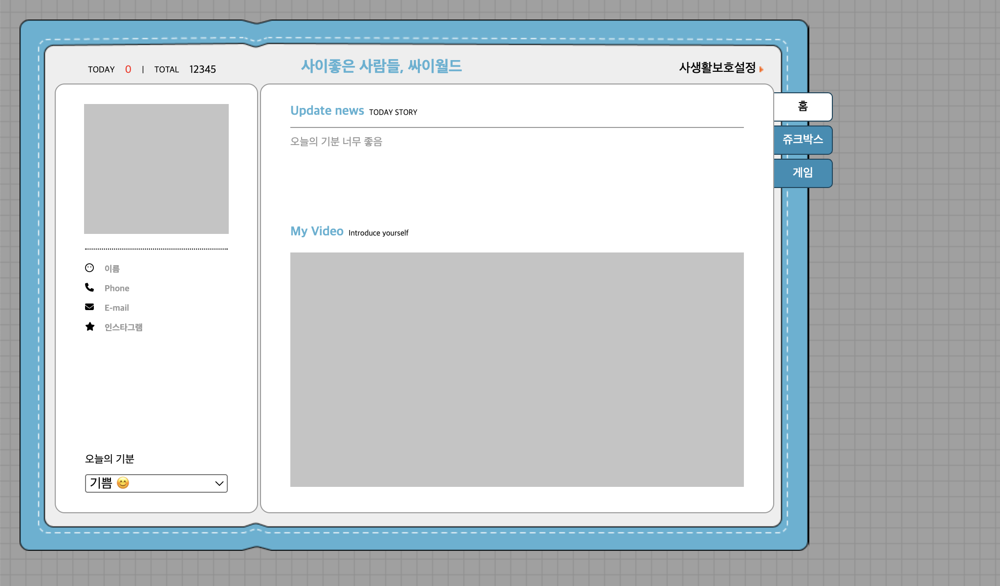

# 🌟 싸이월드 (Cyworld)

> **"시작은 프리캠프"**  
> HTML, CSS, JavaScript 기초를 익히기 위한 싸이월드 스타일의 웹페이지 프로젝트입니다.  
> 강의에서 제공된 Figma 디자인을 참고하여 구현하였습니다.

---

## 📌 프로젝트 소개

HTML, CSS, 기초 Javascript 연습을 위한 싸이월드 클론 프로젝트입니다.  
홈, 쥬크박스, 게임 페이지로 구성되어 있으며, 각각의 기능은 HTML, CSS, JavaScript의 기초를 활용하였습니다.

---

## 📷 페이지 미리보기

### 🏠 Home



-   **좌측 프로필 영역**: 이미지, 이름, 전화번호 등 정보 표시, 오늘의 기분은 `select` 태그로 선택 가능
-   **메인 영역**: 오늘의 스토리, 개인 비디오 표시
-   **우측 탭 영역**: 클릭 시 메인 영역에 Home, Jukebox, Game 페이지 표시

---

### 🎵 Jukebox


-   제공된 BGM 리스트 구현
-   `table` 태그를 학습하며 `th`, `tr`, `td` 이해 및 활용

---

### 🎮 Game


-   제공된 미니게임 리스트를 사용 (끝말잇기, 로또 번호 생성기)
-   JavaScript로 끝말잇기 로직 구현: 사용자의 입력 단어와 제시어 비교 → 일치 시 제시어 업데이트

---

## 🛠 기술 스택

-   HTML
-   CSS
-   JavaScript (Vanilla)

---

## 💻 실행 방법

```bash
git clone https://github.com/pepper-sister/cyworld.git
```
